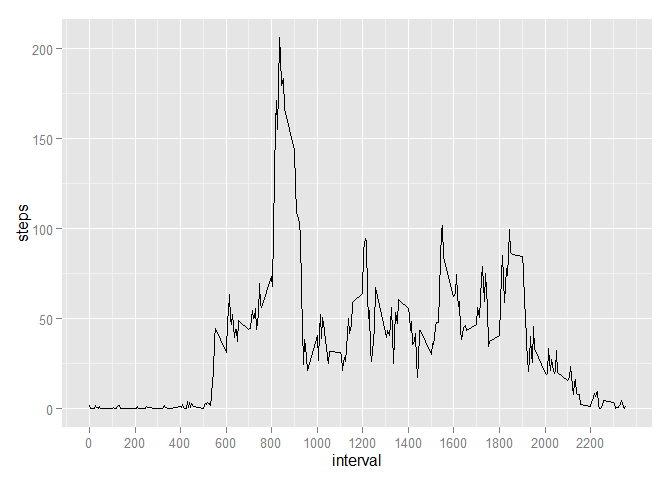

# Reproducible Research: Peer Assessment 1


## Loading and preprocessing the data

Load packages

```r
library(ggplot2)
library(dplyr)
```

Load data and clean data set

```r
activity <- read.csv("activity.csv")
#activity.withNA <- activity
#activity <- filter(activity,!is.na(steps))
```


## What is mean total number of steps taken per day?

1. Calculate the total number of steps taken per day:

```r
activity.bydate <- aggregate(FUN = sum, by = activity["date"], x=activity["steps"])
activity.bydate
```

```
##          date steps
## 1  2012-10-01    NA
## 2  2012-10-02   126
## 3  2012-10-03 11352
## 4  2012-10-04 12116
## 5  2012-10-05 13294
## 6  2012-10-06 15420
## 7  2012-10-07 11015
## 8  2012-10-08    NA
## 9  2012-10-09 12811
## 10 2012-10-10  9900
## 11 2012-10-11 10304
## 12 2012-10-12 17382
## 13 2012-10-13 12426
## 14 2012-10-14 15098
## 15 2012-10-15 10139
## 16 2012-10-16 15084
## 17 2012-10-17 13452
## 18 2012-10-18 10056
## 19 2012-10-19 11829
## 20 2012-10-20 10395
## 21 2012-10-21  8821
## 22 2012-10-22 13460
## 23 2012-10-23  8918
## 24 2012-10-24  8355
## 25 2012-10-25  2492
## 26 2012-10-26  6778
## 27 2012-10-27 10119
## 28 2012-10-28 11458
## 29 2012-10-29  5018
## 30 2012-10-30  9819
## 31 2012-10-31 15414
## 32 2012-11-01    NA
## 33 2012-11-02 10600
## 34 2012-11-03 10571
## 35 2012-11-04    NA
## 36 2012-11-05 10439
## 37 2012-11-06  8334
## 38 2012-11-07 12883
## 39 2012-11-08  3219
## 40 2012-11-09    NA
## 41 2012-11-10    NA
## 42 2012-11-11 12608
## 43 2012-11-12 10765
## 44 2012-11-13  7336
## 45 2012-11-14    NA
## 46 2012-11-15    41
## 47 2012-11-16  5441
## 48 2012-11-17 14339
## 49 2012-11-18 15110
## 50 2012-11-19  8841
## 51 2012-11-20  4472
## 52 2012-11-21 12787
## 53 2012-11-22 20427
## 54 2012-11-23 21194
## 55 2012-11-24 14478
## 56 2012-11-25 11834
## 57 2012-11-26 11162
## 58 2012-11-27 13646
## 59 2012-11-28 10183
## 60 2012-11-29  7047
## 61 2012-11-30    NA
```


2. Make a histogram of the total number of steps taken each day

```r
ggplot(na.omit(activity), aes(date,steps)) +
    geom_histogram(stat = "identity") +
    theme(axis.text.x = element_text(angle = 90, vjust=0.5))
```

 

3. Calculate and report the mean and median of the total number of steps taken per day

```r
stepstats <- summary(activity.bydate$steps)
stepstats
```

```
##    Min. 1st Qu.  Median    Mean 3rd Qu.    Max.    NA's 
##      41    8841   10760   10770   13290   21190       8
```

The **mean** total number of steps taken per day is **10770** steps/day and the **median** is **10760** steps/day


## What is the average daily activity pattern?

Average data by daily time interval

```r
activity.byinterval <- aggregate(FUN = mean, by = activity["interval"], x=activity["steps"], na.rm=TRUE)
```

1. Make time series plot (avg steps taken per interval, across all days)

```r
ggplot(na.omit(activity.byinterval), aes(interval,steps)) + 
  geom_line() + 
  scale_x_continuous(breaks = seq(min(activity.byinterval$interval), 
                                  max(activity.byinterval$interval), by = 200))
```

 

2. Get the interval with max average steps

```r
maxsteps <- summary(activity.byinterval$steps)["Max."]
maxinterval <- filter(activity.byinterval, as.integer(steps)==as.integer(maxsteps))
```

The time interval averaging the maximum number of steps is the **835** interval


## Imputing missing values

1. Calculate and report the total number of missing values in the dataset


## Are there differences in activity patterns between weekdays and weekends?
